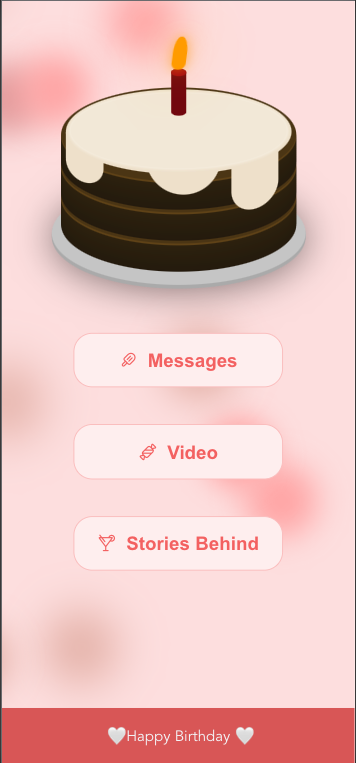

# 🎂 Birthday Webpage

> Stop writing cards or posting content on social media to say "Happy Birthday!" <br>
> Programmers should celebrate important days in their lives in a "programmer's way." 



This is a birthday SPA (Single-Page-Application)  using [Vue.js](https://vuejs.org/).

I made this website for my girlfriend's birthday and thought that this might help out some frontend boys and girls!
I modified some content to make it more general and easy to configure. 


Feel free to [contact me](mailto:amos70180@gmail.com) for more information or custom designs.

## 💻 Prerequisites
You will need [Node.js](https://nodejs.org) version 6.0 or greater installed on your system.

```
npm install
```

### Compiles and hot-reloads for development
```
npm run serve
```
Now the website will be running on port 8080:
  >  http://localhost:8080

### Compiles and minifies for production
```
npm run build
```

### Lints and fixes files
```
npm run lint
```

## 📝 Customize configuration

Find all the TODO tags in the code to configure this webpage.

Including : 

1. Landing page's content
2. Messages page's content and images
3. Video page's YouTube video
4. Stories behind page's content
